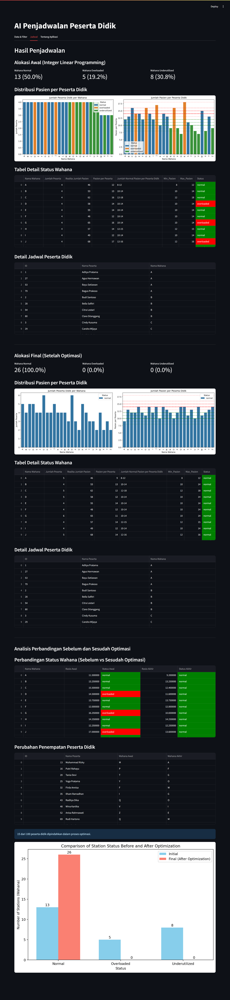
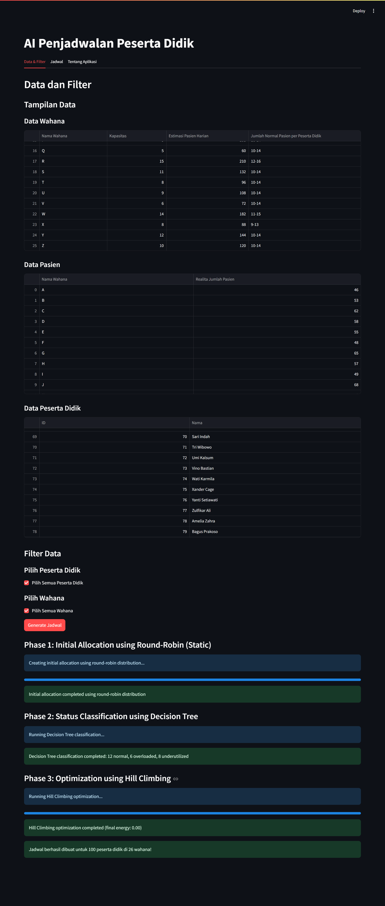

# AI Penjadwalan Peserta Didik

Aplikasi ini menggunakan kecerdasan buatan untuk melakukan penjadwalan peserta didik ke wahana/fasilitas berdasarkan data peserta, wahana, dan pasien. Tiga algoritma utama digunakan: Round-Robin, Decision Tree, dan Hill Climbing untuk menghasilkan jadwal yang optimal dan seimbang.

## Fitur

- **Round-Robin**: Alokasi awal peserta ke wahana secara merata.
- **Decision Tree**: Klasifikasi status wahana (normal, overloaded, underutilized) berdasarkan rasio pasien per peserta.
- **Hill Climbing**: Optimasi penempatan peserta jika ditemukan ketidakseimbangan.
- Visualisasi status wahana dan perubahan penempatan peserta sebelum dan sesudah optimasi.
- Tampilan interaktif menggunakan Streamlit.

## Cara Menjalankan

1. **Clone repositori ini** dan pastikan file data CSV tersedia di folder `Dummy/`:
   - `Dummy/Data_Peserta_Didik.csv`
   - `Dummy/Data_Pasien.csv`
   - `Dummy/Data_Wahana.csv`

2. **Install dependencies**:
   ```bash
   pip install -r requirements.txt
   ```

3. **Jalankan aplikasi Streamlit**:
   ```bash
   streamlit run schedule.py
   ```

4. **Akses aplikasi** melalui browser pada alamat yang ditampilkan oleh Streamlit.

## Struktur Data

- **Data Peserta Didik**: Informasi peserta yang akan dijadwalkan.
- **Data Wahana**: Informasi wahana/fasilitas, kapasitas, dan batas pasien normal.
- **Data Pasien**: Jumlah pasien aktual di setiap wahana.

## Penjelasan Algoritma

1. **Round-Robin**: Membagi peserta ke wahana secara bergiliran.
2. **Decision Tree**: Mengklasifikasikan status wahana berdasarkan rasio pasien per peserta.
3. **Hill Climbing**: Memindahkan peserta antar wahana untuk meminimalkan ketidakseimbangan.

## Output

- Jadwal awal dan akhir penempatan peserta.
- Status wahana sebelum dan sesudah optimasi.
- Visualisasi perbandingan status wahana.

## Interface



